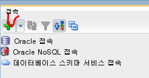
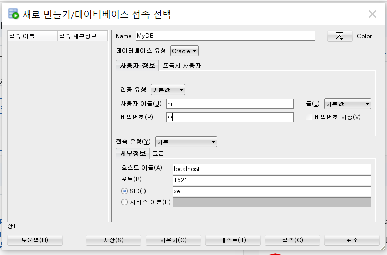
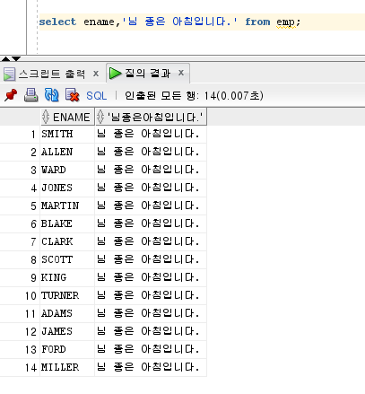
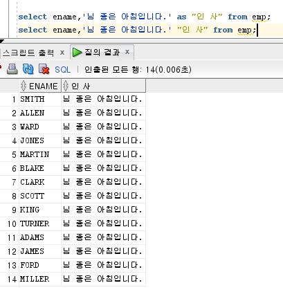
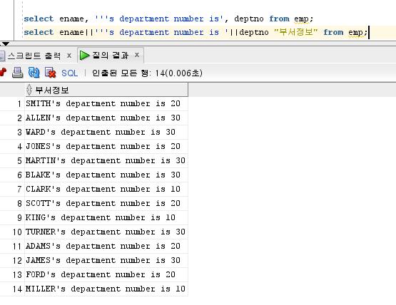
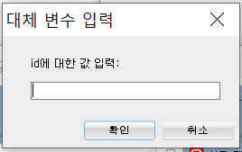

- 오라클 데이터베이스 설치
- sqldeveloper 설치


# DBMS 개요와 Oracle 소개

- 데이터베이스 : 대용량의 데이터 집합을 체계적으로 구성해놓은 것
- DBMS (DataBase Management System) : 데이터베이스를 관리하는 소프트웨어
  - 계층형, 망형, 관계형, 객체지향형, 객체관계형으로 분류됨
- 관계형 데이터베이스 => `SQL` (Structured Query Language) 사용
- Oracle : Oracle의 DBMS 소프트웨어
  - 상용 에디션(Enterprise, Standard, Standard ONE, Personal)과 무료 에디션(Express) 제공

## 데이터베이스의 정의와 특징

### DBMS 개요

> 데이터의 집합

- DBMS : 데이터베이스를 관리, 운영하는 역할

- Oracle, SQL Server, MySQL, MariaDB, PostgreSQL, DB2, Access, SQLite 등이 있음

#### 특징

- 데이터의 무결성 : DB 안의 데이터는 어떤 경로를 통해 들어왔든지 데이터에 오류가 있어서는 안 됨 => `제약 조건`
- 데이터의 독립성 : DB의 크기를 변경하거나 데이터 파일의 저장소를 변경하더라도, 기존에 작성된 응용프로그램은 전혀 영향을 받지 않아야 함
- 보안 : DB 안의 데이터에, 데이터를 소유한 사람이나 데이터의 접근이 허가된 사람만 접근할 수 있어야 함
- 데이터 중복의 최소화 : 동일 데이터 중복 저장 방지
- 응용프로그램 제작 및 수정이 쉬워짐 : 통일된 방식으로 응용프로그램을 작성할 수 있고, 유지보수 또한 쉬워짐
- 데이터의 안전성 향상 : 대부분의 DBMS가 제공하는 백업, 복원 기능을 이용함으로써 데이터가 깨지는 문제가 발생할 경우, 원상태로 복원/복구하는 방법이 명확해짐

#### 데이터베이스의 발전

1. 오프라인으로 관리 : 컴퓨터가 없던 시기에도 회사를 운영하기 위해서는 수입, 지출이 있었을 것이고 그것을 종이에 기록했을 것
2. 파일 시스템의 사용 : 컴퓨터를 사용하면서, 종이에 기록하던 내용을 컴퓨터 파일에 기록하여 저장하게 되었음
3. 데이터베이스 관리 시스템 : 파일 시스템의 단점을 보완하고 대량의 데이터를 보다 효율적으로 관리, 운영하기 위해서 사용되기 시작함

#### DBMS 분류

- 계층형
  - 각 계층은 트리 형태
  - 1:N
- 망형
- 관계형 (RDBMS)
  - 데이터베이스는 `테이블`이라 불리는 최소 단위로 구성되어 있음
  - 테이블은 하나 이상의 열로 구성되어 있음

#### SQL

> 관계형 데이터베이스에서 에서 사용되는 언어

- DBMS 제작 회사와 독립적 (표준이 있음)
- 다른 시스템으로 이식성 좋음
- 표준이 계속 발전함
- 대화식 언어
- 분산형 클라이언트/서버 구조


### Oracle 데이터베이스 소개

> Oracle사에서 제작한 DBMS 소프트웨어 (Oracle RDBMS, Oracle)

- 데이터베이스 관리(DBMS) 소프트웨어 : 대량의 데이터를 관리해주는 소프트웨어

#### 

### 설치 :hammer_and_wrench:

1. setup.exe 실행
2. 비밀번호 설정 (교육에서는 oracle로 통일)
3. sqldeveloper는 압축만 풀면 됨


#### :bulb: Oracle 자동 실행 되지 않게 하기

- 컴퓨터를 킬 때마다 자동으로 실행됨
- 속도가 느려질 수 있음
- 수동으로 제어
  1. 제어판 - 관리 도구 - 서비스
  2. OracleXETNListener, OracleServiceXE 열어서 서비스 상태 **중지**
  3. 시작 유형을 **수동**으로 변경
- Start Database를 통해 시작


### DB 접속

- DBMS가 켜져 있지 않을 경우 접속 불가

- SQL command Line 실행

  ```sql
  conn / as sysdba; /* sysdba로 접속 => Connected */
  conn hr/hr; /* hr로 접속해보기 : 해당 계정이 잠겨있다는 에러가 뜨는 경우 unlock해줘야 함 */
  conn / as sysdba; /* 다시 sysdba로 접속한 후 */
  alter user hr account unlock; /* hr 계정을 unlock */
  alter user hr identified by hr; /* 비밀번호 변경 */
  conn hr/hr; /* hr 계정으로 접속 */
  ```

  - conn 계정이름/비밀번호
  - alter user 계정이름 identified by 비밀번호


### SQL developer

1. sqldeveloper.exe로 실행
2. 새 DB 만들기
   
3. DB 설정
   
   - Name : 사용하고 싶은 이름 입력
   - 사용자 이름, 비밀번호 : DB에 접속한 계정의 이름과 비밀번호 입력


---


# SQL

## 1. SELECT

> 데이터 조회

- 대소문자 구별 X
- 끝에 세미콜론

- 데이터 조회

  - 전체

    ```sql
    SELECT * FROM 테이블명;
    ```

  - 특정 칼럼

    ```sql
    SELECT 칼럼명 FROM 테이블명;
    SELECT 칼럼명1,칼럼명2,... FROM 테이블명;
    /* 여러 줄로 쓸 수 있음 */
    SELECT 칼럼명1,칼럼명2,...
    FROM 테이블명;
    ```

- 테이블 구조 파악

  ```sql
  DESC 테이블명; /* 테이블에 대한 설명 */
  ```

- 접근 가능한 테이블 목록

  ```sql
  SELECT * FROM tab;
  ```

- 문자열을 붙일 수 있음

  - 작은 따옴표로 쓸 것

  ```sql
  SELECT 칼럼명, '문자열' FROM 테이블명
  ```

  
  - `'`를 써야 할 땐 `''` 두 개를 연달아 씀

    ```sql
    select ename, '''s department number is', deptno from emp;
    ```


### AS

> 별칭

```sql
SELECT 칼럼명1, '문자열' as "칼럼명2" FROM 테이블명
SELECT 칼럼명1, '문자열' "칼럼명2" FROM 테이블명 /* as 생략 가능 */
```




 ### 연결 연산자

> 데이터를 이어붙이고 싶을 때 `||`로 연결

```sql
select ename||'''s department number is '||deptno "부서정보" from emp;
```



### DISTINCT

> 중복 행 제거

```sql
SELECT DISTINCT 칼럼명 from 테이블명;
```


### WHERE

> 원하는 것만 골라냄

```sql
SELECT 칼럼명/표현식
FROM 테이블/뷰
WHERE 조건;
```


### 다양한 연산자

- =

- !=, <>

- 부등호(>, >=, <, <=)

- BETWEEN a AND b, IN (a,b,c)

- LIKE a

  ```sql
  select name from professor where name like '김%';
  ```

  - '김'으로 시작하는 name을 가진 professor의 name

- IS NULL, IS NOT NULL

- a AND b, a OR b, NOT a

  - AND가 OR보다 우선순위가 높음 :exclamation:

### &

> 입력 받음

```sql
select ename, job, sal from emp where empno=&변수;
```



### ORDER BY

> 정렬

```sql
/* 칼럼명을 기준으로 정렬 */
select ... from 테이블명 order by 칼럼명;
/* 칼럼명3, 칼럼명2를 기준으로 정렬 */
select 칼럼명1, 칼럼명2, 칼럼명3 from emp order by 3,2;
```

- default : asc (오름차순, 생략 가능)

- 내림차순으로 정렬 => `desc`

  ```sql
  /* 칼럼명3을 기준으로 내림차순,
     칼럼명2를 기준으로 오름차순 정렬 */
  select 칼럼명1, 칼럼명2, 칼럼명3 from emp order by 3 desc, 2;
  ```

### 집합 연산자

- UNION ALL : 합집합(두 집합의 결과를 합쳐서 출력)
- UNION : UNION ALL + **중복 값 제거**, **정렬**
- INTERSECT : 교집합, **정렬**
- MINUS : 차집합, **정렬**


## 2. 단일행 함수

> 결과가 하나의 행인 것

### 문자 함수

- 대소문자 변환 : INITCAP(첫글자를 대문자로), LOWER, UPPER
- 길이 : LENGTH(길이), LENGTH**B**(바이트 수)
- 결합하거나 추출 : CONCAT(=`||`), **SUBSTR**, SUBSTRB, **INSTR**, INSTRB
  - SUBSTR(문자열/컬럼명, 시작 위치, 가져올 개수)
    - 시작 위치가 음수일 경우, 뒤에서부터 자릿수 계산
    - 개수를 생략하면 문자열 끝까지 가져옴
  - INSTR(문자열/컬럼명, 찾는 글자, 시작 위치, 몇 번째인지(default=1))
    - 시작 위치가 음수일 경우 반대 순서로 찾음
    - 없으면 0 반환
- 채우거나 삭제 : LPAD, RPAD, LTRIM, RTRIM
  - **L**PAD(문자열/컬럼명, 자릿수, 채울 문자)	
    - 해당 자릿수가 될 때까지 **왼쪽**에 특정 문자를 채움
    - **R**PAD는 오른쪽에 채움
  - **L**TRIM(문자열/컬럼명, 제거할 문자)
    - default = ' ' (스페이스)
- 치환
  - REPLACE(문자열/컬럼명, 문자1, 문자2)
- 특정 패턴을 찾아서 연산 : REGEXP_REPLACE, REGEXP_INSTR, REGEXP_SUBSTR, REGEXP_LIKE, REGEXP_COUNT

### 숫자 함수

- ROUND : 반올림
- TRUNC : 버림
- MOD : 나머지
- CEIL : 올림
- FLOOR : 버림
- POWER : 제곱