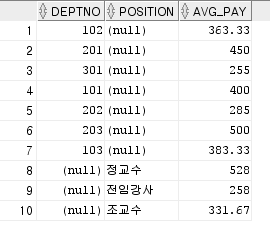

## 2. 단일행 함수

### 숫자 함수

- ROUND(숫자, 출력을 원하는 자릿수) : 반올림
  - ROUND(n,`2`) : 소수점 둘째자리까지 표시
  - ROUND(n,`-1`) : 1의 자리에서 반올림
- TRUNC(숫자, 원하는 자릿수) : 버림
- MOD : 나머지
- CEIL : 주어진 숫자에서 가장 가까운 큰 정수 (소수점 이하 올림)
- FLOOR : 주어진 숫자에서 가장 가까운 작은 정수 (소수점 이하 버림)
- POWER(숫자1, 숫자2) : 숫자1을 숫자2만큼 제곱

### 날짜 관련 함수

- SYSDATE : 시스템의 현재 날짜와 시간

  ```sql
  select sysdate from dual;
  ```

  :bulb: 쿼리에서 특정 테이블이 필요하지 않을 때, 대신 `dual`을 씀

- MONTHS_BETWEEN : 두 날짜 사이의 개월 수

- ADD_MONTHS : 주어진 날짜에 개월을 더함

- NEXT_DAY : 주어진 날짜를 기준으로 돌아오는 날짜

  ```sql
  select sysdate, NEXT_DAY(sysdate, '월') "NEXT DAY" from dual; /* 다가오는 월요일 날짜 */
  ```

- LAST_DAY : 주어진 날짜가 속한 달의 마지막 날짜

- ROUND : 주어진 날짜를 반올림

- TRUNC : 주어진 날짜를 버림

- 날짜 형식 바꾸기

  ```sql
  alter session set NLS_DATE_FORMAT='RRRR-MM-DD:HH24:MI:SS';
  alter session set NLS_DATE_FORMAT='RR/MM/DD';
  ```

- TO_DATE(문자열) : 문자열을 날짜형으로 만듦


### 형 변환 함수

- CHAR(n) : 고정 길이의 문자 저장, 최대 2000bytes
  - n : 데이터 크기
- **VARCHAR2**(n) : 가변 길이의 문자 저장, 최대 4000bytes
- NUMBER(p,s) : 숫자
  - p는 전체 자리수 (1~38), s는 소수점 이하 자리수(-84~127)
- DATE : BC 4812/01/01~ AD 9999/12/31, 총 7bytes
- LONG : 가변 길이의 문자 저장, 최대 2GB
- CLOB : 가변 길이의 문자 저장, 최대 4GB
- BLOB : 가변길이의 바이너리 데이터 저장, 최대 4GB
- RAW(n) : 원시 이진 데이터 저장, 최대 2000bytes
- LOG RAW(n) : 원시 이진 데이터, 2GB
- BFILE : 외부 파일에 저장된 데이터, 4GB


#### 명시적 형 변환

- TO_CHAR(숫자) => 문자
  - 9 : 9의 개수만큼 자리수
  - 0 : 빈자리를 9으로 채움
  - $ : $ 표시를 붙여서 표시
  - . : 소수점 이하를 표시
  - , : 천 단위 구분 기호 표시
- TO_NUMBER((숫자처럼 생긴) 문자) => 숫자
- TO_DATE(문자) => 날짜
- TO_CHAR(날짜, 원하는 형식) => 문자
  - YYYY/**RRRR**/YY/RR/YEAR(영문)
  - MM/MON/MONTH
  - DD/DAY(요일)/DDTH(몇 번째 날인지)
  - HH24(24시간)/HH(12시간)/MI(분)/SS(초)

#### 묵시적 형 변환

```sql
select 2+'2' from dual; /* 4 */
```


### 일반 함수

- NVL(col1, col2) : col1이 null이면 col2로 치환

- NVL2(col1, col2, col3) : col1이 null이 아니면 col2, null이면 col3

- **DECODE**(A, B, val1, C, val2, D, val3, ... , valn) :star:

  - A가 B이면 val1, C이면 val2, D이면 val3, ... , 전부 아니면 valn
  - 마지막 null은 생략 가능
  - if-else if-else 문과 비슷

- CASE

  - 비교 조건이 '='인 경우

    ```sql
    CASE(A) WHEN B THEN val1
    		WHEN C THEN val2
    		...
    		ELSE valn
    END
    ```

  - 비교 조건이 '='이 아닌 경우

    ```sql
    CASE() WHEN B THEN val1
    	   WHEN C THEN val2
    	   ...
    	   ELSE valn
    END
    ```


## 3. 복수행 함수

### GROUP 함수

- COUNT, SUM, AVG, MAX, MIN, STDDEV(표준편차), VARIANCE(분산)

  - COUNT(*) : 전체 데이터 개수
    COUNT(col) : 해당 필드가 null이 아닌 행의 개수

- ROLLUP : 그룹별 소계

  ```sql
  group by rollup(col1, col2)
  ```

  - col1, col2로 그룹화하고 col1별로 소계를 냄 + 전체 소계

  

  - 전체 소계 필요 없을 때

    ```sql
    group by col1, rollup(col2)
    ```

    

    ```sql
    group by rollup(col1), col2
    ```

    

- CUBE

  ```sql
  group by cube(col1, col2)
  ```

  - 전체 소계 + col2별 소계 + 중간중간 col1별 소계

  

- GROUPING SETS : 따로따로 그룹핑한 것을 한번에 가져오기

  ```sql
  select deptno, position, round(avg(pay),2) "AVG_PAY"
  from professor
  group by grouping sets(deptno, position);
  ```

  

- LISTAGG, PIVOT, LAG, LEAD, RANK, DENSE_RANK


### Group by 주의 사항

- SELECT절에 사용된 그룹함수 이외의 컬럼이나 표현식은 반드시 GROUP BY절에 사용되어야 함
  - 그렇지 않을 경우 에러 발생
  - GROUP BY절에 사용된 컬럼이라도 SELECT절에는 사용하지 않아도 됨
- GROUP BY절에는 반드시 컬럼명이 사용되어야 하며 컬럼 Alias는 사용하면 안 됨
- 그룹핑한 조건으로 검색하기 (`HAVING`절 사용)


## 4. JOIN

### EQUI Join (등가 Join)

- Oracle Join : 오라클에서만 쓸 수 있음

  ```sql
  select e.ename, e.deptno, d.dname
  from emp e, dept d
  where e.deptno=d.deptno;
  ```

- ANSI Join

  ```sql
  select e.ename, e.deptno, d.dname
  from emp e [inner] join dept d
  on e.deptno=d.deptno;
  ```

:bulb: 테이블 간 컬럼명이 겹칠 경우, `테이블명.컬럼명`으로 구분해야 함

### Outer Join

- Oracle Outer Join

  ```sql
  /* Left outer join */
  select s.name Student, p.name Professor
  from student s, professor p
  where s.profno=p.profno(+);
  
  /* Right outer join */
  select s.name Student, p.name Professor
  from student s, professor p
  where s.profno(+)=p.profno;
  
  /* Full outer join */
  select s.name Student, p.name Professor
  from student s, professor p
  where s.profno=p.profno(+)
  UNION
  select s.name Student, p.name Professor
  from student s, professor p
  where s.profno(+)=p.profno;
  ```

- ANSI Outer Join

  ```sql
  /* Left outer join */
  select s.name Student, p.name Professor
  from student s LEFT OUTER JOIN professor p
  ON s.profno=p.profno;
  
  /* Right outer join */
  select s.name Student, p.name Professor
  from student s RIGHT OUTER JOIN professor p
  ON s.profno=p.profno;
  
  /* Full outer join */
  select s.name Student, p.name Professor
  from student s FULL OUTER JOIN professor p
  ON s.profno=p.profno;
  ```


---

#### DB 데이터 삭제


## 5. DDL과 딕셔너리

> 데이터 정의

- DML (Data Manipulation Language) : INSERT, UPDATE, DELETE, MERGE
- DDL (Data Definition Language) : CREATE, ALTER, TRUNCATE(잘라내기), DROP
- DCL (Data Control Language) : GRANT, REVOKE
- TCL (Transaction Control Language) : COMMIT, ROLLBACK
  - transaction : 작업 단위
- SELECT

### CREATE

```sql
create table t1
(
    컬럼명	 데이터 타입
    no		NUMBER(3),
    name	VARCHAR2(10),
    birth	DATE
);
```

- 기본 입력값(default) 설정

  ```sql
  create table t2
  (
      컬럼명	 데이터 타입
      no		NUMBER(3)		DEFAULT 0,
      name	VARCHAR2(10)	DEFAULT 'No Name',
      birth	DATE			DEFAULT SYSDATE
  );
  ```

- 한글 이름으로 테이블 생성 가능하지만, 하지 말 것 :exclamation: (인코딩 등의 문제 생기기 쉬움)
- 테이블명 중복 불가
  
  - 다른 계정의 테이블명은 사용 가능

#### 임시 테이블(Global Temporary Table)

- 실제 데이터를 저장하지 않고 테스트 등 임시 용도로 사용
- 속도 빠름


#### 테이블 복사

- 모든 컬럼 다 복사

  ```sql
  create table t1_1
  as
  	select * from t1;
  ```

- 특정 컬럼만 복사

  ```sql
  create table t1_2
  as
  	select col1, col2
  	from t1;
  ```

- 데이터 없이 테이블 구조만 가져오기

  ```sql
  create table t1_2
  as
  	select *
  	from t1
  	where 1=2;
  ```

  - where절에 거짓 조건을 넣음

### ALTER

> 테이블 변경

- 테이블에 컬럼 추가

  ```sql
  ALTER TABLE t2
  Add (location varchar2(10));
  ```

- 테이블의 컬럼명 변경

  ```sql
  ALTER TABLE t2 RENAME COLUMN location TO loc
  ```

- 테이블명 변경

  ```sql
  RENAME t2 TO t2_1
  ```

- 컬럼 변경

  ```sql
  alter table t2
  modify (loc varchar2(20));
  ```

- 컬럼 삭제

  ```sql
  alter table t2
  drop column loc;
  ```

  - 다른 테이블에서 해당 컬럼을 참조하는 경우

    ```sql
    alter table t2
    drop column loc CASCADE CONSTRAINTS;
    ```

    - `CASCADE CONSTRAINTS` : 다른 테이블의 관련 데이터도 지움

### TRUNCATE

> 테이블의 데이터 삭제

```sql
truncate table t2;
```

### DROP

> 테이블 삭제

```sql
drop table t2;
```

### DELETE

> 테이블의 데이터 삭제

```sql
delete from t2;
```


#### :bulb: TRUNCATE vs DROP vs DELETE


