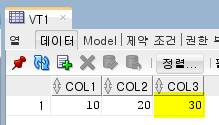
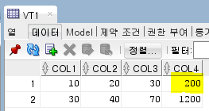
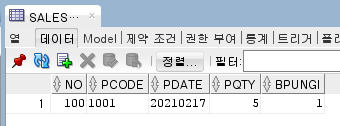

#### 읽기 전용 테이블로 변경

```sql
alter table t6 read only;
```

- 쓸 수 있게 바꾸기

  ```sql
  alter table t6 read write;
  ```

#### 가상 컬럼

```sql
create table vt1
(   col1 number,
    col2 number,
    col3 number generated always as (col1+col2) virtual);

insert into vt1 values(10,20,30); -- error
insert into vt1 values(10,20); -- error
insert into vt1 (col1, col2) values(10,20);
```



- col1, col2의 순서를 바꿔도 상관 없지만, 보통 순서대로 씀

  ```sql
  insert into vt1 (col2, col1) values(40,30);
  ```

- 테이블이 만들어진 후, 가상 컬럼을 추가하면 기존에 있던 데이터들도 계산되어 값이 들어감

  ```sql
  alter table vt1
  add ( col4 generated always as (col1*col2) virtual);
  ```

  

- 복잡한 조건을 줄 수 있음

  ```sql
  create table sales10
  (   no      number,
      pcode   char(4),
      pdate   char(8),
      pqty    number,
      bpungi  number(1) generated always as (
          case when substr(pdate,5,2) in ('01','02','03') then 1
               when substr(pdate,5,2) in ('04','05','06') then 2
               when substr(pdate,5,2) in ('07','08','09') then 3
               when substr(pdate,5,2) in ('10','11','12') then 4
          end) virtual);
  
  insert into sales10 (no,pcode,pdate,pqty) values(100,'1001','20210217',5);
  ```

  

### 완전 삭제

```sql
drop table t6 purge;
```


## 6. DML

> 데이터 관리

```sql
create table t6 (
    no      number constraint temp_py primary key,
    name    varchar2(20) not null,
    addr    varchar2(30),
    joindate    date default sysdate);
```

- `constraint ~` : 나중에 제어하기 위해 넣은 것 (생략 가능)


### INSERT

> 데이터 삽입

- 서브쿼리를 이용해 insert

  ```sql
  insert into t6_1
  select * from t1 where col1=v1;
  ```

- 한 테이블의 데이터를 여러 테이블에 나눠 넣을 경우

  ```sql
  insert all
  when col1 between 1000 and 1999 then into t6_1 values (col1,col2)
  when col1 between 2000 and 2999 then into t6_2 values (col1,col2)
  select col1, col2
  from t6;
  ```

- 한 테이블의 데이터를 여러 테이블에 똑같이 넣을 경우

  ```sql
  insert all
      into t6_1 values(col1,col2)
      into t6_2 values(col1,col2)
  select col1,col2
  from t6
  where col1 between 3000 and 3999;
  ```


### UPDATE

> 데이터 변경

```sql
UPDATE table
SET column = value
WHERE 조건;
```


### DELETE

> 데이터 삭제

```sql
DELETE FROM table
WHERE 조건;
```


### MERGE

> 데이터 병합

```sql
/* table1에 table2를 병합 */
MERGE INTO table1
USING table2
ON (병합 조건절)
WHEN MATCHED THEN -- 동일한 데이터가 있을 때 처리 내용
	UPDATE SET 업데이트 내용
	DELETE WHERE 조건
WHEN NOT MATCHED THEN -- 동일한 데이터가 없을 경우 데이터 삽입
	INSERT VALUES(컬럼명);
```


## 7. 제약 조건 (Constraint)

> 테이블에 올바른 데이터만 입력 받고 잘못된 데이터는 들어오지 못하도록 컬럼마다 정하는 규칙 (무결성)

- NOT NULL : null값 입력 X
- UNIQUE : 중복 값 입력 X
- PRIMARY KEY
  - NOT NULL + UNIQUE
  - 테이블 내에서 데이터들끼리의 유일성을 보장
  - 테이블당 1개만 설정 가능
- FOREIGN KEY : 다른 테이블의 컬럼 참조해서 검사
- CHECK : 설정된 값만 입력 허용

```sql
create table t7 (
    col1 NUMBER(4)
    	CONSTRAINT t7_col1_pk PRIMARY KEY,
    col2 VARCHAR2(20)
    	CONSTRAINT t7_col2_nn NOT NULL,
    col3 VARCHAR2(13)
    	CONSTRAINT t7_col3_nn NOT NULL
    	CONSTRAINT t7_col3_uk UNIQUE,
    col4 NUMBER(1)
    	CONSTRAINT t7_col4_ck CHECK 조건식(ex. col4 < 5),
    col5 VARCHAR2(6)
    	CONSTRAINT t7_col5_fk REFERENCES t6(col)
);
```

- 간단하게 설정

  ```sql
  create table t7 (
      col1 NUMBER(4) PRIMARY KEY,
      col2 VARCHAR2(20) NOT NULL,
      col3 VARCHAR2(13) NOT NULL UNIQUE,
      col4 NUMBER(1) CHECK 조건식(ex. col4 < 5),
      col5 VARCHAR2(6) REFERENCES t6(col)
  );
  ```

  - CONSTRAINT_NAME이 자동으로 생김

- 제약 조건 추가

  ```sql
  alter table t7
  add constraint t7_col1_uk unique(col1);
  
  -- NOT NULL은 modify로 변경
  alter table t7
  modify (col2 constraint t7_col2_nn not null);
  
  -- foreign key
  alter table t7
  add constraint t7_col7_fk foreign key(col7) references t6(col6);
  ```

- 제약 조건 삭제

  ```sql
  alter table t7
  drop constraint t7_col_fk;
  ```


## 10. Sub Query

```sql
SELECt select_list
FROM table/view
WHERE 조건 연산자 ( SELECT select_list
             	   FROM table
             	   WHERE 조건 );
```

- WHERE절 연산자 오른쪽에 위치해야 함
- 괄호로 묶어야 함
- Top-n 분석 등 특별한 경우를 제외하고는 서브쿼리절에 Order by절이 올 수 없음
- 단일 행 서브쿼리와 다중 행 서브쿼리에 따라 연산자를 잘 선택해야 함


### 단일 행 Sub Query (Single Row Sub Query)

- =, <>, >, >=, <, <=


### 다중 행 Sub Query (Multi Row Sub Query)

- IN : 같은 값
- EXISTS : 값이 있을 경우 메인 쿼리 수행
- \>ANY : 최솟값
- <ANY : 최댓값
- <ALL : 최솟값
- \> ALL : 최댓값


### 상호 연관 Sub Query

> Main query값을 Sub query에 주고 Sub query를 수행한 후 그 결과를 다시 Main query로 반환해서 수행하는 Sub query


### Scala Sub Query (스칼라 서브쿼리)

```sql
SELECT (Sub Query) : Scala Sub Query
FROM (Sub Query) : Inline View
WHERE (Sub Query) : Sub Query
```

- 출력할 데이터 양이 많을 경우 Join이 유리, 적을 경우 Scalar sub query가 유리
- 2건 이상의 데이터 반환을 요청하거나 2개 이상의 컬럼을 조회하는 경우 에러 발생