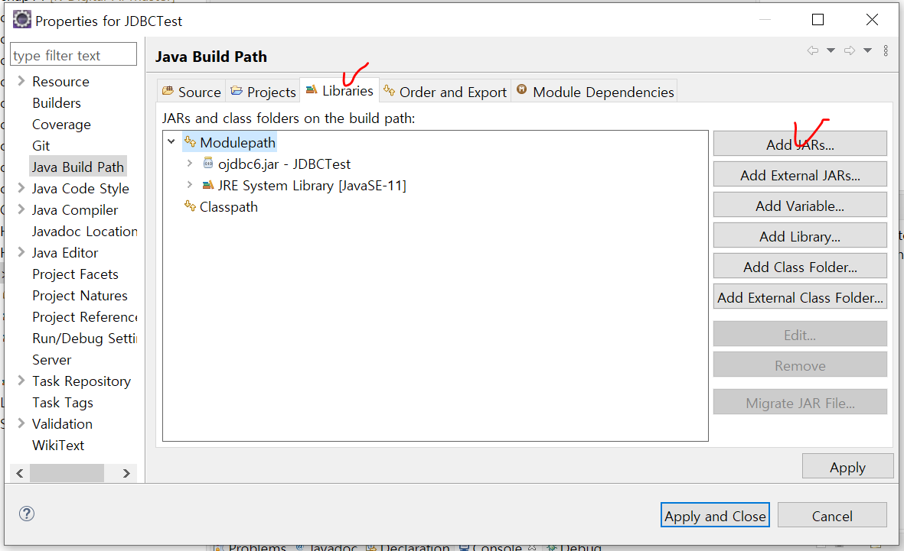
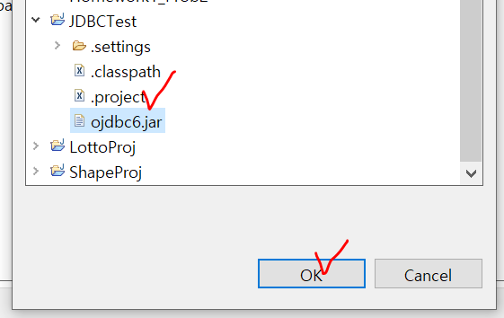
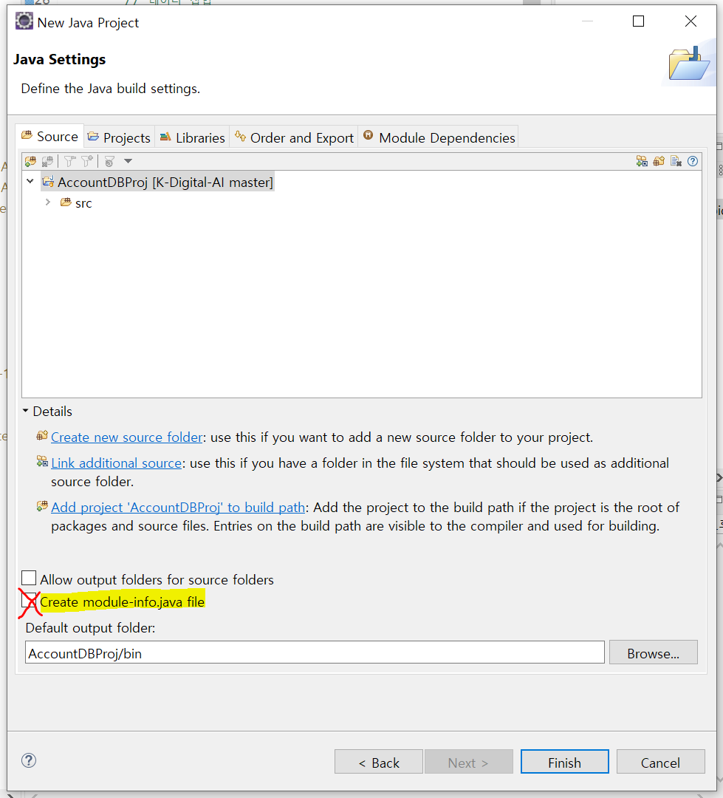
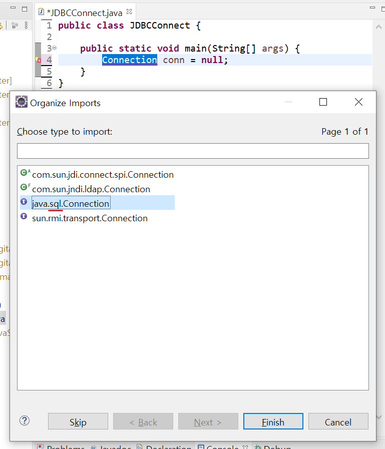
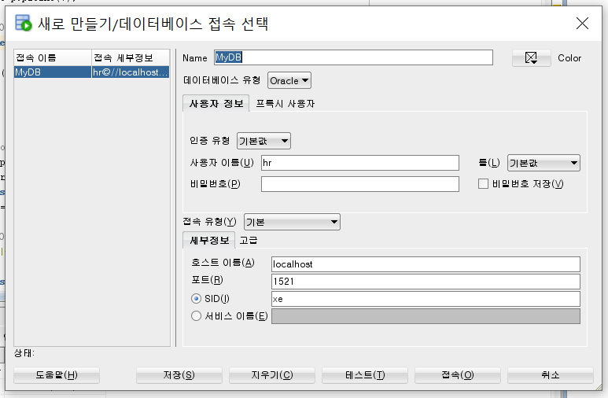

# 데이터베이스의 분석과 설계

## 데이터 모델링

> 사용자의 요구사항을 분석하여 추상화, 문서화하는 과정

- 데이터 모델
  - 현실 세계를 데이터베이스에 표현하는 중간 과정
  - 데이터의 구조를 이해하기 위한 도구
- 데이터베이스 설계
  - 개념적 구조 => 논리적 구조 => 물리적 구조
  - **모델**이 핵심

- 과정

    1. 요구사항 분석 : 현행 업무 분석, 요구 기능 분석, 산출물(요구 사항 명세서)
    2. 개념적 데이터 모델링 : 개체/관계 도출, 산출물(개체-관계 모형)
    3. 논리적 데이터 모델링 : 정규화
    4. 물리적 데이터 모델링 : 테이블 설계
    5. 데이터베이스 구축 : 데이터베이스 생성


### 요구사항 분석

- 사용자와의 면담을 통해서 얻은 내용으로 사용자의 요구사항을 간단하게 기술
- 요구사항 명세서, 업무 흐름도

### 개념적 설계

- 업무 처리에 필요한 자료와 속성을 기술
- 자료 간의 관계를 정의
- 특정 데이터베이스에 구애되지 않고 골격 구축
- 일반적으로 개체 관계 모델(ERD, Entity Relationship Diagram) 사용
  - 데이터베이스의 전체 구조를 쉽게 나타냄
  - 사용자와 함께 업무 분석, 검토할 때 이용
  - 개체 간 관계를 이해하고 그림으로 표시

#### 개체

> 실세계에서 기본적으로 표현할 수 있는 항목 (=레코드)

- 관리 대상이 되는 독립적 특성을 갖는 것 (사람, 사물, 사건, 개념 등)
- 사각형으로 표시

#### 속성

> 성질, 상태 등  개체가 가질 수 있는 세부적 특성

- 타원으로 표현
- 개체에 실선으로 연결
- 데이터의 가장 작은 논리적인 단위 (=필드)

#### 인스턴스

> 개체의 구체적인 하나의 예 (하나의 개체에 해당하는 실제 데이터)

#### 기본 키

> 인스턴스들을 서로 구별할 수 있는 유일한 값을 갖는 속성

- 하나의 개체 내에 똑같은 인스턴스가 존재 => 서로 구별하여 검색할 수 없고, 데이터 중복 문제 발생 => PK
- 속성에 밑줄 표시

#### 관계

> 개체 간의 연관성

- 관계가 있는 개체를 실선으로 연결하고 마름모 사각형 안에 관계 표시

#### 릴레이션 :star:

> 튜플의 집합 (=테이블)

- 속성 : 릴레이션에서 열의 이름
- 도메인 : 하나의 속성이 취할 수 있는 같은 타입의 모든 원자 값들의 집합
- 튜플 : 릴레이션의 한 행

### 논리적 설계

#### 정규화

> 데이터의 손실이나 불필요한 정보의 도입 없이 데이터의 일관성, 데이터 중복을 최소화하고 최대의 데이터 안정성 확보를 위한 안정적 자료구조로 변화하기 위해서 하나의 테이블을 둘 이상으로 분리하는 작업

### 물리적 설계

- 개발에 사용할 데이터베이스를 선정
- 특정 데이터베이스로 구현될 수 있도록 구체적으로 설계
- 테이블 명세서
- 개체를 테이블로 변환
- ERD의 개체를 하나의 테이블로 나타내고, 각 개체의 속성을 테이블의 필드로 변환
- ERD의 개체 간 관계는 테이블의 외래키나 또 다른 테이블로 변환
- 각 속성에 대해 데이터의 형식, 각종 제약 조건, 인덱스 등 설정

#### 일대일 관계

- 하나의 테이블로 통합

#### 일대다 관계

- 주종 관계를 따져서 부모 테이블과 자식 테이블 구분
- **일반적으로 1에 해당하는 테이블이 부모 테이블, N에 해당되는 테이블이 자식 테이블**
- **부모 테이블의 기본 키를 자식 테이블에 포함시키고 외래키로 설정**

#### 다대다 관계

- 새 테이블을 만들어 두 테이블의 기본키를 포함시키고 테이블의 외래키로 설정
  - 새 테이블의 기본키 설정하는 방법 
    1. 두 개의 외래키를 조합하여 기본키로 설정
    2. 새로운 필드를 추가하여 기본키로 설정 ​(​일반적으로 이 방식 사용:heavy_check_mark:)


# 데이터베이스와 Oracle 연동

1. C:\oraclexe\app\oracle\product\11.2.0\server\jdbc\lib
2. ojdbc6.jar 복사
3. Eclipse 프로젝트에 붙여넣기
4. 프로젝트에서 Build Path - Configure Build Path
5. Libraries - Add JARs 
   
6. ojdbc6.jar 추가한 후 적용
   


 ## Eclipse-DB 연결

```java
public static void main(String[] args) {
		Connection conn = null;
		try {
			Class.forName("oracle.jdbc.OracleDriver"); // 드라이버 설정
			conn=DriverManager.getConnection("jdbc:oracle:thin:@localhost:1521:xe","hr","hr"); // DB와 연결
			System.out.println("connected");
		} catch (SQLException e) {
			e.printStackTrace();
		} catch (ClassNotFoundException e) {
			e.printStackTrace();
		} finally {
			try {
				if (conn!=null) conn.close();
			} catch (SQLException e) {
				e.printStackTrace();
			}
		}
 	}
```

- 프로젝트 생성 시 `Create module-info.java file` 체크 해제 :exclamation:

  
- Import `Connection`

  

- DB에 연결할 때 쓰는 주소의 정보는 해당 데이터베이스의 속성에서 확인할 수 있음
  

  - jdbc:oracle:thin:@`localhost`:`1521`:`xe`
  - 계정 이름 `hr`


## Eclipse에서 SQL 활용하기

- 조회(select) => execute**Query**()

  ```java
  stmt.executeQuery("select * from t_member");
  ```

- insert, update, delete => ResultSet, execute**Update**()

  - 실제 변경된 행의 수를 반환
  - resultSet으로 받아서 ArrayList로 만듦 : 쿼리를 통해 받은 데이터를 클래스화 시켜서 더 접근하기 쉽도록!
  - `rs.next()`를 해줘야 첫 행을 처리해줄 수 있으므로, 반환된 데이터의 개수가 하나여도 rs.next() 없이 처리하면 에러남

- DAO (Data Access Object) : 쿼리에 관련된 것

- 문자열로 쿼리를 작성

  ```java
  /* Statement를 이용해 SQL문을 실행하여 ResultSet에 저장 */
  Statement stmt = null;
  ResultSet rs = null;
  String sql = "select * from t_member";
  stmt = conn.createStatement();
  rs = stmt.executeQuery(sql);
  ...
  mem.setId(rs.getString("id")); // 필드명으로 접근 가능
  mem.setId(rs.getString(1)); // 반환된 데이터의 순서로 접근 가능
  ```

  - SQL문에 특정 값이 들어가야 하는 경우, `PreparedStatement`를 이용하여 대입해 줌

    ```java
    PreparedStatement pstmt = null;
    String sql = "insert into t_member values (?,?,?,?,?)";
    pstmt = conn.prepareStatement(sql);
    ...
    pstmt.setString(1, member.getId()); // 해당 데이터를 ?에 차례대로 대입함
    ```

- 실행 함수마다 connection을 close했는데, main에서 여러 함수를 실행할 경우, connection이 close된 상태라 에러남

  => close 함수를 따로 만들고 main 마지막에 실행시켜 connection을 close해줌

  ```java
  public void connectClose() {
      try {
          if (conn!=null) conn.close();
      } catch (SQLException e) {
          e.printStackTrace();
      }
  }
  ```


---

:honey_pot: `Ctrl+Shift+Enter` : 커서?가 어디 위치해있는지 상관 없이 다음줄로 줄바꿔서 내려감

:honey_pot: **생성자** 만들 때, `Source - Generate Constructor using Fields`에서 필요한 필드 골라서 생성

:honey_pot: **toString** 만들 때, `Source - Generate toString()` 이용해서 원하는 필드 골라서 생성