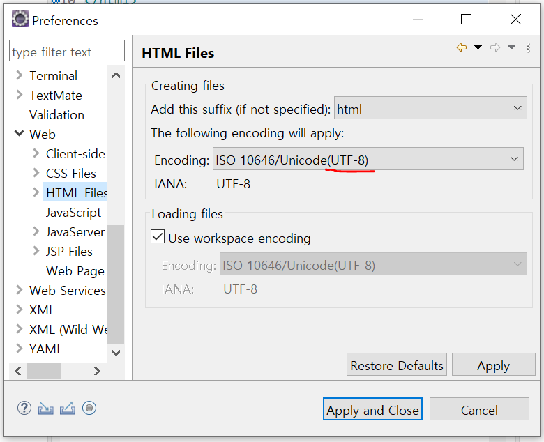
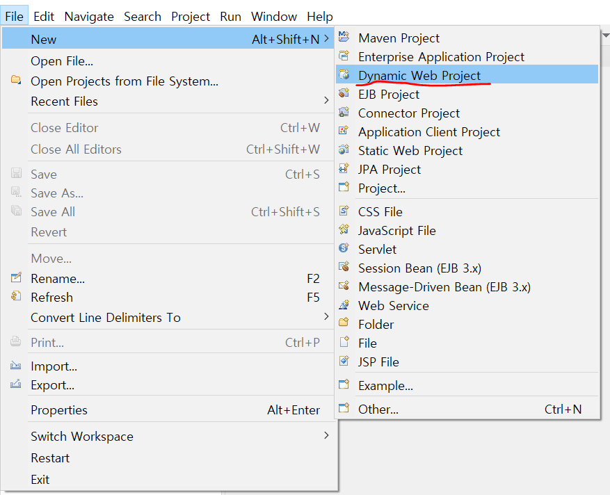
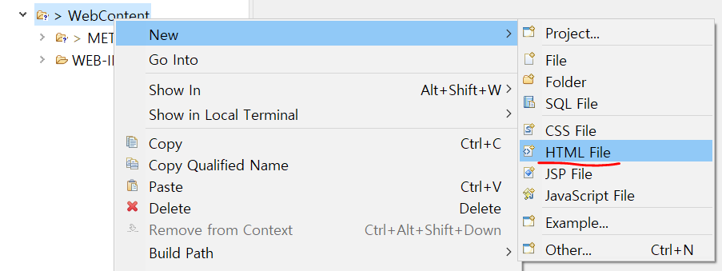

# 1. 웹 개요와 실습 환경 구축

## 인터넷과 웹 시작

- 인터넷
  - 전세계를 연결하는 국제 정보 통신망
  - 컴퓨터나 스마트폰 같은 디지털기기로 연결되어 사람들이 정보를 공유할 수 있는 공간
- 웹 : 인터넷 공간에서 제공하는 서비스


## 웹 브라우저 전쟁과 웹 표준

- 플러그인 : 웹 브라우저와 연동되는 프로그램을 사용자의 PC에 추가로 설치해 웹 브라우저의 기능을 확장하는 방법
  - 어도비 플래시, 마이크로소프트 액티브X 등


## 웹 동작

- 웹(Web) : 요청과 응답 과정
- URL : 웹에서 어떤 대상을 구분하는 주소

- 서버(제공자) : 응답하는 쪽
  - 백 엔드
  - 웹 프레임워크(ASP.NET, JSP, PHP 등), MVC 프레임워크(ASP.NET, Spring MVC, Ruby on Rails 등), 비동기 프레임워크(Node.js, Express, Jetty)
- 클라이언트(사용자) : 요청하는 쪽
  - 프론트 엔드
  - HTML, CSS, 자바 스크립트

## 웹 표준 기술과 HTML5 주요 기능

- HTML5 : 웹 페이지 구성
- CSS3 : 스타일 적용
- 자바 스크립트 : 사용자 반응 처리


## HTML5를 공부하면 좋은 이유

- 애플리케이션 수준의 웹 페이지를 만들 수 있음


## 실습 환경 구축

- 인코딩 `UTF-8`로 변경

  

- 프로젝트 생성
  

  - File - New - Dynamic Web project

- 파일 생성

  


# 2. 웹  페이지 기본 구조와 작성 방법

## HTML5 기본 용어

- 요소 : HTML 페이지를 구성하는 각 부품

  - 내용을 가질 수 있는 요소 : h1, p, audio 등
  - 내용을 가질 수 없는 요소 : img, br, hr

- 태그 : 요소를 만들 때 사용하는 작성 방법

- 속성 : 태그에 추가 정보를 부여할 때 사용하는 것

  - h1-`title`, img-`src`

- 주석 : 코드 설명 기록

  ```html
  <!-- 주석 -->
  ```

  - `Ctrl + Shift + /`

- HTML5 페이지의 구조

  - html 태그 : 웹 페이지의 사용 언어를 구글 검색 엔진에 제공
  - head

- 스타일

  ```html
  <style>
      @charset "UTF-8";
      h1 {
          color:white;
          background:black;
      }
  </style>
  ```

  - `~.css` 파일로 만들어 html 문서와 연결

    ```html
    <link rel="stylesheet" href="style.css">
    ```

- 스크립트

  ```html
  <script>
      alert('경고');
      document.write('hello JavaScript..!');
  </script>
  ```

  - `~.js` 파일로 만들어 html 문서와 연결

    ```html
    <script src="OuterJavaScript.js"></script>
    ```


# 3. HTML5 기본 태그

## 글자 태그

- h1~h6 : 제목 글자 생성
- p, br, hr : 본문 생성
- a : 하이퍼링크 생성
- b, i, small, sub, sup, ins, del : 글자 모양 지정
  - i : 이탤릭
  - sub : 아래 첨자
  - sup : 위 첨자
  - ins : 밑줄
  - del : 취소선

## 목록 태그

- ul : 순서가 없는 목록
- ol : 순서가 있는 목록
- li : 목록 요소

## 테이블 태그

- table, tr, th, td

## 미디어 태그

> 이미지, 오디오, 비디오 등 멀티미디어를 넣을 때 사용

- img, audio, video
- video-`poster` : 동영상을 불러오는 동안 사용자에게 보여줄 이미지 경로 입력


# 4. HTML5 입력 양식 태그와 구조화 태그

## 입력 양식 태그

> 사용자에게 정보를 입력받는 요소

### form

```html
<body>
    <form>
        <input type="text" name="search">
        <input type="submit">
    </form>
</body>
```

- method 속성의 방식으로 action 속성 장소에 데이터 전달
  - GET : 주소에 데이터를 입력해서 전달
  - POST : 주소 변경 없이 비밀스럽게 데이터 전달
- input
  - text, button, checkbox, file, hidden, image, password, radio, reset, submit
    - radio : 각 항목의 name 속성을 같게 입력하면 그 항목들 중 하나만 선택됨
- textarea
- select/optgroup/option : 선택 양식 생성/옵션 그룹화/옵션 생성
  - select-`multiple` : 여러 개 선택 가능

