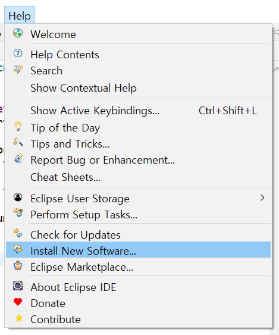
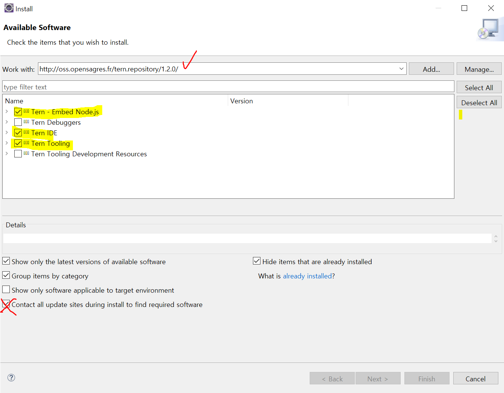

# 11. jQuery 라이브러리

## jQuery 설치

> 이클립스에서 설치

1. `Help - Install New software`
   
2. Work with에 http://oss.opensagres.fr/tern.repository/1.2.0/ 복붙 + Enter
   
   - 3가지 선택하고 맨밑 Contact all update ~ 체크 해제한 후 설치
3. 이클립스 재시작
4. 적용할 프로젝트에서 `Configure - Convert to Tern Project...`
5. Browser, CKEditor, jQuery 체크 후 적용
   - `Ctrl + Space` 로 js, jQuery를 불러올 수 있음 (자동완성)


## 이벤트

- 이벤트 모델 : 문서 객체에 이벤트를 연결하는 방식

- 인라인 이벤트 모델 : HTML 태그 내부에 자바스크립트 코드를 넣어 이벤트를 연결하는 방식 => 보통 쓰지 않음.. :x:

- 이벤트 연결

  ```javascript
  $(selector).method(function (event) { });
  ```

- on() : 이벤트 연결

  ```js
  $(selector).on(eventName, eventHandler);
  ```

- off() : 이벤트 제거

